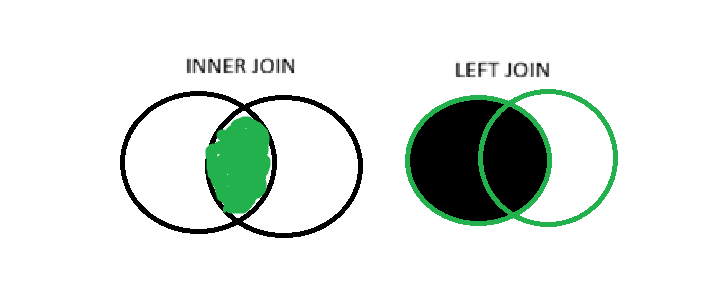

# Conocimientos Técnicos

API REST desarrollada en .NET 10 / C# para la gestión de consultas de facturas.

## 1. ¿Cuál es la diferencia entre '==' y '===' en PHP?

- R/ - En PHP '==' antes de comparar los valores, verifica si es necesario hacer una conversión de tipos,
    de ser el caso realiza una conversión automaticamente y luego compara los valores. En caso contrario, '==='
    compara valor y tipo, sin necesidad de conversión, si el valor y el tipo no es el mismo, el resultado debe
    ser false.


### Ejemplo

```bash
    <?php
    $num = 1;
    $str = "1";

    var_dump($num == $str);
    var_dump($num === $str);
    ?>
```
En la primera parte devuelve true, ya que convierte el string a int y compara el numero.
En la segunda parte devuelve false porque aunque el valor sea el mismo (1) son tipos diferentes (int vs string).

## 2.  ¿Qué valor retorna 'NaN == NaN' en JavaScript y por qué?

R/ -En JavaScript el resultado sería false porque NaN es un valor especial y no hay forma de comprobar que un NaN sea un NaN
    a menos que se use isNaN, pero si validamos 

## 3. ¿Qué hace .on('click', ...) comparado con .click() en jQuery?

R/ -En jQuery .on('click', ...)  maneja clics en elementos actuales y futuros (añadidos dinámicamente) que coincidan con el selector, en cambio .click(), solo vincula el evento a elementos que ya existen en el DOM cuando se ejecuta el código.

### Ejemplo

```bash
    // Con .click() – solo funciona si el botón ya existe
    $("#miBoton").click(function() { alert("Clic"); });

    // Con .on() con delegación – funciona incluso si .dynamic-btn se añade después
    $(document).on("click", ".dynamic-btn", function() {
    alert("Botón dinámico clicado");
    });
```


## 4. ¿Qué diferencia hay entre INNER JOIN y LEFT JOIN en SQL?

R/ En SQL INNER JOIN devuelve solo registros con coincidencia en ambas tablas y LEFT JOIN devuelve todos los registros de la tabla izquierda, y las coincidencias de la tabla derecha. Y devuelve con NULL en la derecha si no hay coincidencia.




## 5. ¿Qué es una condición falsy? Da tres ejemplos en PHP y JavaScript.

R/ Una condición falsy es un valor que se evalúa como false cuando se convierte a booleano (por ejemplo, dentro de un if).

### Ejemplo en php:
```bash
    if (!false){ echo "false es falsy\n"; }

    if (!0){ echo "0 es falsy\n"; }

    if (!""){ echo '"" es falsy' . "\n"; }
```

### Ejemplo en JavaScript:
```bash
    if (!null) {console.log("null es falsy")} ;

    if (!undefined){console.log("undefined es falsy")} ;

    if (!NaN){console.log("NaN es falsy")} ;
```